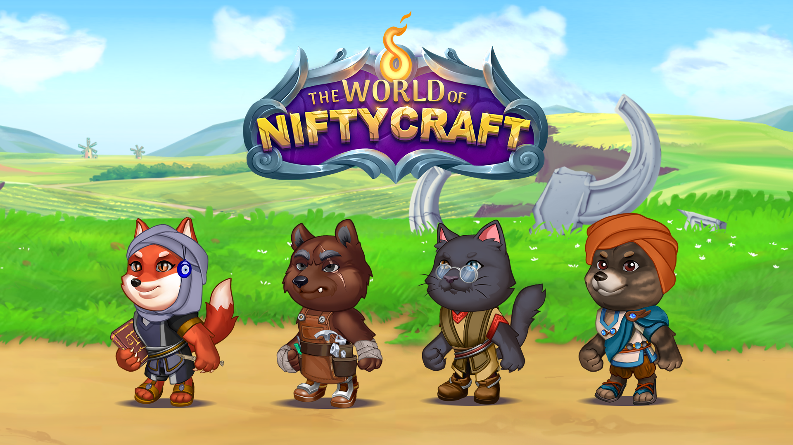

# The-World-Of-Niftycraft
The World of Nifty Craft is a 2D fantasy sandbox multiplayer RPG featuring a Real Time Card Battler combat system.

## 🕹️ About the Project
The World of Nifty Craft is a 2D fantasy sandbox multiplayer RPG featuring a Real Time Card Battler combat system.

## 🔧 Features
- MMO sandbox RPG
- Card battler
- Gathering, Crafting, Refinig, Battle

## 🎮 Demo
[Watch Gameplay on Steam](https://store.steampowered.com/app/2438410/The_World_of_Nifty_Craft/)

## 📸 Screenshots

## 👨‍💻 Role
I developed the game mechanics, user interface, and implemented networking using C# in Unity with Nakama and Photon Fusion.

## 🌐 Platform
- Unity 2022
- Windows (.exe)
